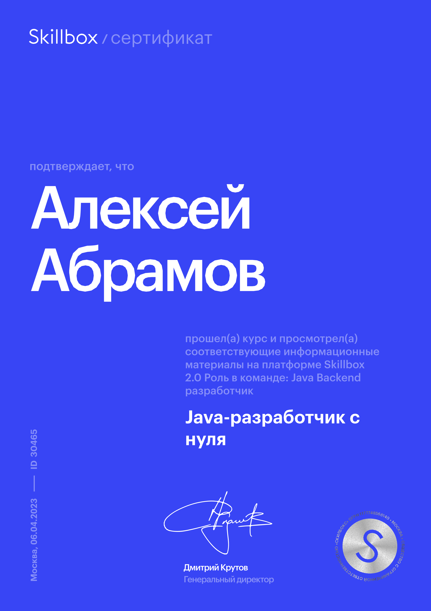
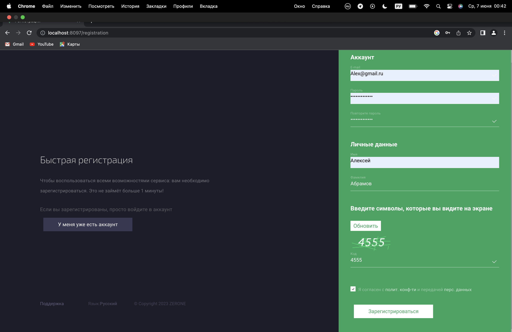
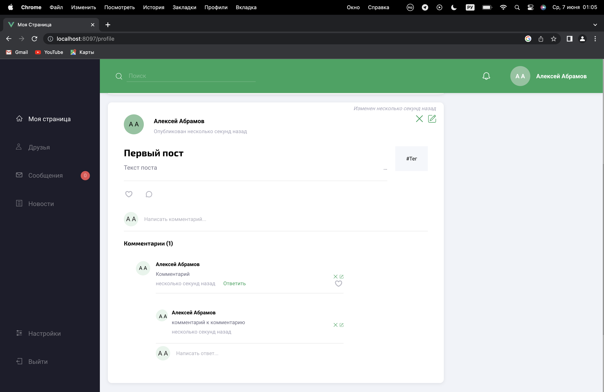
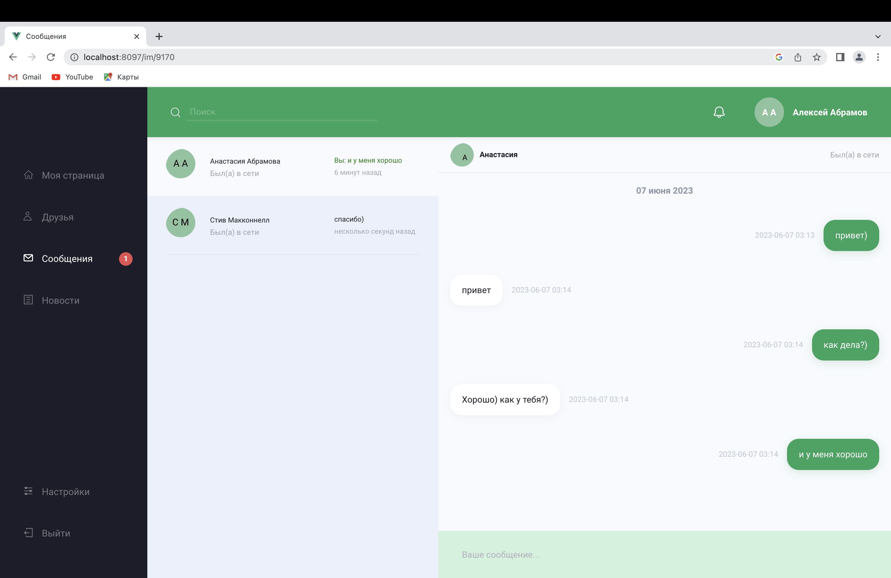

# Social-Service

----

### Technology stack: 
* Java 
* Spring Boot 
* Spring Data 
* Spring Security 
* PostgreSQL
* liquibase 
* Kafka
* K8s
* Swagger 
* WebSocket 
* Junit
* Mockito

____

I was part of the development team for this project. We got the frontend and wrote a project for it. 
[Presentation of our project.](https://www.youtube.com/watch?v=O9mZNYOEGKc)

### This is my certificate:

____

### My work on the project.

1. First task was to create a captcha and add it to the registration. A captcha picture with symbols is formed on the backende and comes to the front. Next comes the check for correct character input from the user. 
2. The second task was to create, delete and change posts, tags for posts and comments for posts. 
3. Next, I worked on the dialogues.

____

### How to start our project?

To do this, run the following docker commands:

``docker run -d --name frontend-alpha -p 8099:80 -p 8098:80 -p 8097:80 team33/front-for-local:1.0``

``docker run -p 5432:5432 --name postgres -e POSTGRES_PASSWORD=postgres -d postgres``

``docker network create kafkanet``

``docker run -d --network=kafkanet --name=zookeeper -e ZOOKEEPER_CLIENT_PORT=2181 -e ZOOKEEPER_TICK_TIME=2000 -p 2181:2181 wurstmeister/zookeeper:latest``

``docker run -d --network=kafkanet --name=kafka -e KAFKA_ZOOKEEPER_CONNECT=zookeeper:2181 -e KAFKA_ADVERTISED_LISTENERS=PLAINTEXT://localhost:9092 -e KAFKA_OFFSETS_TOPIC_REPLICATION_FACTOR=1 -p 9092:9092 confluentinc/cp-kafka:latest``

Then clone the repository:``git@github.com:alexeyabramov12/Social-Service.git`` and run in Intellij IDEA.

